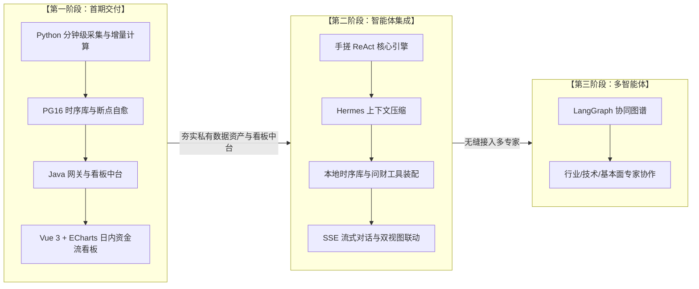

# 股票投研系统开发总纲与实施计划：先资金流向看板，后 ReAct 智能体

> **版本**：v2.0.0 (Decoupled Production Architecture)  
> **更新时间**：2026-09-19  
> **实施总则**：**渐进式演化，各施所长** —— 采用「**Python 数据挖掘机与智能体 + PostgreSQL 高频时序库 + Java 业务中台与微服务网关 + Vue 3 看板**」的现代化解耦架构。

---

## 目录
1. [项目演进全景与分期策略](#1-项目演进全景与分期策略)
2. [第一阶段：日内板块资金流向看板（当前攻坚核心）](#2-第一阶段日内板块资金流向看板当前攻坚核心)
   - [2.1 业务场景与数据解耦流向设计](#21-业务场景与数据解耦流向设计)
   - [2.2 数据源采集与增量计算机制](#22-数据源采集与增量计算机制)
   - [2.3 A 股交易时钟与迟到开机自愈补数机制 (12点开机场景)](#23-a-股交易时钟与迟到开机自愈补数机制-12点开机场景)
   - [2.4 PostgreSQL 16 时序快照存储与索引设计](#24-postgresql-16-时序快照存储与索引设计)
   - [2.5 Java 看板服务与微服务网关架构](#25-java-看板服务与微服务网关架构)
   - [2.6 前端 Vue 3 + ECharts 交互与呈现设计](#26-前端-vue-3--echarts-交互与呈现设计)
3. [第二阶段：手搓白盒 ReAct 智能体体系（后续落地规划）](#3-第二阶段手搓白盒-react-智能体体系后续落地规划)
   - [3.1 Hello-Agents 极简工具注册器 `@register_tool`](#31-hello-agents-极简工具注册器-register_tool)
   - [3.2 Hermes 三明治上下文压缩引擎 (Head-Tail-Middle)](#32-hermes-三明治上下文压缩引擎-head-tail-middle)
   - [3.3 五层防封数据源与 Pandas 量化指标计算底座](#33-五层防封数据源与-pandas-量化指标计算底座)
   - [3.4 会话持久化与 FastAPI SSE 实时流式打字机](#34-会话持久化与-fastapi-sse-实时流式打字机)
   - [3.5 看盘看板与智能体对话的双视图联动](#35-看盘看板与智能体对话的双视图联动)
4. [第三阶段：LangGraph 多智能体协同网络演进](#4-第三阶段langgraph-多智能体协同网络演进)
5. [项目工程多模块目录结构标准](#5-项目工程多模块目录结构标准)
6. [第一阶段具体实施步骤检查清单](#6-第一阶段具体实施步骤检查清单)

---

## 1. 项目演进全景与分期策略

本系统的研发遵循**“数据看板先行、智能体大脑接管”**的敏捷工程哲学：



- **为什么先做资金流向图？**
  1. **直击交易核心痛点**：A 股典型的存量资金博弈行情，主力资金盘中在哪个板块进出，直接决定日内盈亏，是盯盘第一需求。
  2. **沉淀私有高频数据资产**：把公网瞬时数据沉淀为本地时序库，具备跨日复盘与历史比对能力。
  3. **为 Agent 准备高质量 Ground Truth**：后续 Agent 研判时，可以直接调用这一套现成的资金流时序数据库，回答极度专业，杜绝大模型数字幻觉。

---

## 2. 第一阶段：日内板块资金流向看板（当前攻坚核心）

### 2.1 业务场景与数据解耦流向设计
用户需求：“**在前端构建一个资金一天的流向图。比如 10 点流入了哪些板块，哪些板块流出**”。

```mermaid
sequenceDiagram
    autonumber
    participant Collector as Python 数据挖掘机
    participant EastMoney as 东方财富接口
    participant PG as PostgreSQL 16 时序库
    participant Java as Java 看板中台 (:8081)
    participant Gateway as Spring Cloud 网关 (:8080)
    participant Frontend as Vue 3 看板

    Note over Collector: 仅在周一至周五 09:30~15:00 交易时段激活
    loop 每 1 分钟轮询一次
        Collector->>EastMoney: 抓取当前全市场 86 个行业板块资金快照 (接口一)
        EastMoney-->>Collector: 返回主力累计净流入、涨跌幅、龙头股
        Collector->>Collector: 内存比对计算本分钟瞬时增量 (minute_net_inflow)
        Collector->>PG: 批量写入当前时间切片快照 (带 ON CONFLICT 幂等防重)
    end

    Frontend->>Gateway: 请求今日资金流时序 GET /api/dashboard/sector-flow/timeline
    Gateway->>Java: 路由分发
    Java->>PG: 走 idx_sector_flow_timeline 覆盖索引聚合 240 点
    PG-->>Java: 毫秒级返回时序数据
    Java-->>Gateway-->>Frontend: 格式化 JSON 数据
    Note over Frontend: ECharts 渲染累积折线图与时段切片柱状图 (红进绿出)
```

---

### 2.2 数据源采集与增量计算机制

#### 采集接口选型
- **主接口（接口一）**：东方财富板块资金流轻量接口 `http://push2.eastmoney.com/api/qt/clist/get?fs=m:90+t:2&fields=f12,f14,f2,f3,f62,f66,f72,f78,f84,f184,f204`。
- **瞬时增量计算公式**：
  东财返回的 `f62` 为当日开盘至今的**累计值**。
  每分钟采集时，程序在内存中保留上一分钟的数值，实时推导本分钟瞬时增量：
  $$\Delta = \text{main\_net\_inflow}_{t} - \text{main\_net\_inflow}_{t-1}$$
  将累计值与瞬时增量同步入库，前端出图无需 SQL 窗口函数即可瞬间完成。

#### 防封与极低负载策略
- **轮询频次**：盘中每 **1 分钟** 执行一次全局快照采集；
- **请求负载**：单次请求即可获取全市场 ~86 个行业板块，全天 4 小时交易时间仅需发出 **240 次 HTTP 请求**（60 秒一次），完全属于常规浏览行为，**0 被封风险**。

---

### 2.3 A 股交易时钟与迟到开机自愈补数机制 (12点开机场景)

#### A 股交易日历与时钟状态机
严格遵循交易所作息规则：
- **交易日判定**：周六、周日休市；法定节假日休市；
- **日内交易区间**：
  - `09:25 ~ 09:30`：早盘准备期；
  - `09:30 ~ 11:30`：早盘连续竞价（定时采集运行中）；
  - `11:30 ~ 13:00`：午休闭市（**调度器自动挂起休眠，严禁发送无效请求**）；
  - `13:00 ~ 15:00`：午盘连续竞价（定时采集继续运行）；
  - `15:00 之后`：盘后归档，固化全天完整数据，停止日内采集。

#### 12 点开机自愈补数机制 (利用接口二)
当用户中途开机（例如中午 12:00 启动系统）：
1. **开机自检**：查询数据库今日切片数，发现上午 120 根切片缺失；
2. **并发回溯**：调用东财接口二 `http://push2.eastmoney.com/api/qt/stock/fflow/kline/get?secid=90.{code}&klt=1`；
3. **秒级落库**：2 秒内拉取全市场 86 个板块的上午 120 根完整历史分钟线，解析后通过 `ON CONFLICT DO NOTHING` 批量写入 PostgreSQL；
4. **无缝衔接**：下午 13:00 准时切回接口一按 1 分钟常态轮询。

---

### 2.4 PostgreSQL 16 时序快照存储与索引设计

生产环境采用 Docker 托管的 PostgreSQL 16，表结构见 `docker/postgres/init.sql`：

```sql
CREATE TABLE IF NOT EXISTS sector_fund_flow_snapshots (
    id BIGSERIAL PRIMARY KEY,
    trade_date DATE NOT NULL,                         -- 交易日期 (YYYY-MM-DD)
    snapshot_time TIME(0) WITHOUT TIME ZONE NOT NULL,    -- 快照时刻 (HH:MM:SS)
    sector_code VARCHAR(32) NOT NULL,                 -- 板块代码 (如 BK0420)
    sector_name VARCHAR(64) NOT NULL,                 -- 板块名称 (如 光伏设备)
    change_pct NUMERIC(6, 2) NOT NULL,                -- 板块涨跌幅 (%)
    main_net_inflow NUMERIC(18, 2) NOT NULL,          -- 今日累计主力净流入 (元)
    minute_net_inflow NUMERIC(18, 2) DEFAULT 0,       -- 本分钟瞬时净流入 (元)
    super_large_inflow NUMERIC(18, 2) DEFAULT 0,      -- 超大单净流入 (元)
    large_inflow NUMERIC(18, 2) DEFAULT 0,            -- 大单净流入 (元)
    middle_inflow NUMERIC(18, 2) DEFAULT 0,           -- 中单净流入 (元)
    small_inflow NUMERIC(18, 2) DEFAULT 0,            -- 小单净流入 (元)
    main_inflow_ratio NUMERIC(6, 2) DEFAULT 0,        -- 主力净流入占比 (%)
    lead_stock_code VARCHAR(32),                      -- 领涨龙头股代码
    lead_stock_name VARCHAR(64),                      -- 领涨龙头股名称
    lead_stock_change_pct NUMERIC(6, 2),              -- 领涨龙头股涨幅 (%)
    created_at TIMESTAMPTZ DEFAULT CURRENT_TIMESTAMP NOT NULL
);

-- 核心防重联合唯一索引
CREATE UNIQUE INDEX IF NOT EXISTS uq_sector_flow_date_time_code 
ON sector_fund_flow_snapshots (trade_date, snapshot_time, sector_code);

-- 分时走势覆盖索引
CREATE INDEX IF NOT EXISTS idx_sector_flow_timeline 
ON sector_fund_flow_snapshots (sector_code, trade_date, snapshot_time ASC);

-- 瞬间排名检索索引
CREATE INDEX IF NOT EXISTS idx_sector_flow_snapshot_rank 
ON sector_fund_flow_snapshots (trade_date, snapshot_time, main_net_inflow DESC);
```

---

### 2.5 Java 看板服务与微服务网关架构

* **`trading-gateway` (Spring Cloud Gateway :8080)**：统一对外网关，处理全局 CORS 跨域，统一路由分流：
  * `/api/dashboard/**` ➡️ 转发给 Java 看板中台 (`:8081`)
  * `/api/agent/**` ➡️ 反向代理给 Python 智能体 (`:8000`)
* **`trading-dashboard` (Spring Boot 3 + MyBatis-Plus :8081)**：
  * 高性能只读服务，通过 MyBatis-Plus 查询 PostgreSQL 索引；
  * 提供 `/realtime`（最新榜单）、`/timeline`（全天 240 点时序）、`/snapshot`（特定切片）三大核心 RESTful 接口。

---

### 2.6 前端 Vue 3 + ECharts 交互与呈现设计

* **顶部全天资金时序图**：多板块平滑折线走势，横轴 240 分钟，纵轴以“亿元”为单位，清晰呈现多空分歧；
* **底部时间滑块（Timeline Slider）**：支持在 09:30~15:00 之间任意拖动，瞬间重现当时全市场 Top 10 流入/流出柱状图（红进绿出）；
* **右侧智能体抽屉**：支持与 ReAct 智能体实时流式对话，并可一键把看板数据发送给 Agent 进行深度诊断。

---

## 3. 第二阶段：手搓白盒 ReAct 智能体体系（后续落地规划）

### 3.1 Hello-Agents 极简工具注册器 `@register_tool`
Agent 本身不写死业务，采用纯 Python 装饰器自主注册：
```python
@register_tool(
    name="query_sector_flow_history",
    description="查询特定交易日某板块的全天日内主力资金流走势",
)
def query_sector_flow_history(trade_date: str, sector_name: str) -> dict:
    # 直连 PostgreSQL 时序库取数，保证 100% 数据真实
    ...
```

### 3.2 Hermes 三明治上下文压缩引擎 (Head-Tail-Middle)
* **Head（头部）**：保留系统核心角色 Prompt 与最新板块资金数据定义；
* **Middle（中部）**：动态剪枝历史冗长思考步骤，仅保留关键 Observation 结论；
* **Tail（尾部）**：保留最近两轮用户指令与实时市场状态，杜绝大模型迷失与重复调用。

---

## 4. 第一阶段具体实施步骤检查清单

- [ ] **里程碑 1：数据基座初始化与物理建表**（当前待执行）
  - 执行 `docker/postgres/init.sql`，在本地运行的 PostgreSQL 中创建 `sector_fund_flow_snapshots` 表与 3 大核心索引。
- [ ] **里程碑 2：Python 数据采集挖掘机打通**
  - 在 `agent-python/app/collector/` 下实现 1 分钟常态轮询与增量计算；
  - 实现开机自检与 12 点开机断点自动回溯补齐逻辑；
  - 实测数据批量写入 PostgreSQL。
- [ ] **里程碑 3：Java Maven 多模块搭建与看板 API 交付**
  - 创建 `server-java` 父工程及 `trading-gateway`、`trading-dashboard` 模块；
  - 编写 MyBatis-Plus 实体与分时查询 Mapper；
  - 验证网关透传与 RESTful 接口输出。

- [ ] **里程碑 4：Vue 3 + ECharts 6 看板交互呈现**
  - 前端搭建与双图联动，完成日内看盘闭环。
- [ ] **里程碑 5：Python ReAct 智能体与工具注册集成**
  - 接入大模型、SSE 流式打字机与对话抽屉。
