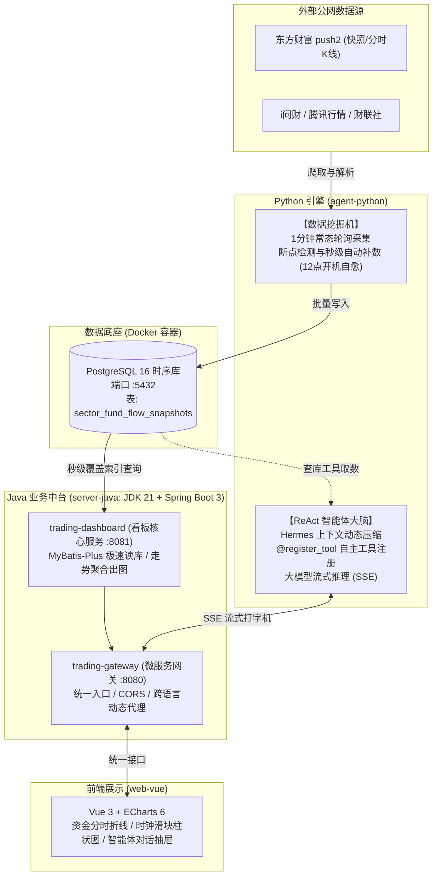

# A股专业投研系统（日内资金流看板 + 智能体研报）项目计划书

> **文档版本**：v1.0.0 (Production Blueprint)  
> **编制日期**：2026-09-19  
> **核心定位**：基于「Python 数据挖掘与智能体 + PostgreSQL 时序中枢 + Java 业务中台与网关 + Vue 3 终端」构建的工业级 A 股量化看板与专业投研智能体系统。

---

## 一、 项目背景与核心诉求

### 1.1 业务背景
A 股市场属于典型的资金与情绪博弈市场，盘中主力资金的流动轨迹（如 09:35 抢筹半导体、10:30 调仓光伏设备）直接反映了超大单机构的真实意图。对于专业交易者而言：
* **第一诉求（看盘）**：需要一张**精准到 1 分钟颗粒度**的全天资金分时走势看板，能够一眼识别日内资金流入/流出排行榜、以及全天 240 根分钟切片的累积轨迹与瞬时暴拉异动。
* **第二诉求（研判）**：不仅看图，更需要具备独立思考能力的 **AI 投研助手（ReAct 智能体）**，能基于真实本地数据执行量化指标计算、联网搜索研报、推演资金异动逻辑。

### 1.2 核心设计哲学
* **数据资产私有化**：绝不单纯做公网接口的无状态透传，必须将高频分时切片沉淀到本地数据库，建立独有的私有真理源（Ground Truth）。
* **各施所长的解耦架构**：
  * **Python**：专精做“脏活累活”——抓取变幻莫测的反爬数据源、执行大模型 ReAct 思考与工具调度；
  * **Java**：专精做“工程底座”——基于 JDK 21 与 Spring Boot 3 构建高可用网关与看板业务中台，保证看盘接口极致稳定与低延迟；
  * **PostgreSQL**：作为二者的数据中枢，**两套语言在日常数据流中互不调用，通过数据库天然解耦**。

---

## 二、 总体系统架构与技术选型

### 2.1 架构全景拓扑图



### 2.2 技术选型清单

| 层次/模块 | 推荐技术栈 | 核心理由 |
| :--- | :--- | :--- |
| **开发环境** | **Windows 本地运行** + **Docker 数据库** | 摆脱 DevContainer 文件权限冲突，断点调试与 IDE 体验极佳 |
| **数据底座** | **PostgreSQL 16 (Docker)** | 原生支持丰富时间函数、复合索引、`ON CONFLICT` 高并发幂等写入 |
| **Java 业务端** | **JDK 21 + Spring Boot 3.3.x** | 虚拟线程（Virtual Threads）高并发、强类型保障中台长期稳定 |
| **Java 持久层** | **MyBatis-Plus 3.5.x** | 高效单表 CRUD，开发体验优于传统 JPA，易于调优 SQL |
| **微服务网关** | **Spring Cloud Gateway 4.x** | 统一端口（`:8080`），前端无感知代理 Java 业务与 Python 智能体 |
| **Python 采集端** | **Python 3.11 + httpx + pandas** | 强大的 A 股反爬与逆向生态，轻量高效，易于维护 |
| **Python 智能体** | **FastAPI + SSE-Starlette + ReAct 手搓引擎** | 极简 `@register_tool` 工具箱装配，低开销流式打字机 |
| **前端看板端** | **Vue 3 (Vite) + Pinia + ECharts 6** | 专业金融图表渲染，日内 240 点多曲线流畅平滑缩放 |

---

## 三、 核心数据链路与闭环设计

### 3.1 1 分钟切片采集与瞬时增量计算
1. **调度窗口**：严格受 A 股时钟守卫约束，仅在周一至周五 `09:30~11:30`、`13:00~15:00` 触发。
2. **抓取源**：调用东财接口一 `http://push2.eastmoney.com/api/qt/clist/get?fs=m:90+t:2`。
3. **指标计算**：
   * 接口返回的 `f62` 为开盘至今的**累计主力净流入**；
   * 采集器在内存中缓存上一分钟各板块数值，实时计算出**本分钟瞬时增量流入**：
     $$\text{minute\_net\_inflow}_{t} = \text{main\_net\_inflow}_{t} - \text{main\_net\_inflow}_{t-1}$$
4. **存储开销**：全市场 86 个行业板块 $\times$ 240 分钟 = **20,640 条/天**（仅占 2~3 MB）。

### 3.2 迟到启动/断线自愈补数机制（如 12:00 开机场景）
1. **开机自检**：Python 采集服务启动时，比对当前系统时间与交易日历。若处于盘中或盘后，立即查询数据库今日已存切片数；
2. **断点回溯**：若今日数据存在空洞（如 12 点开机，数据库切片数为 0），立即激活补数任务：
   * 调用东财接口二 `http://push2.eastmoney.com/api/qt/stock/fflow/kline/get?secid=90.{code}&klt=1`；
   * 并发拉取 86 个板块的上午历史 120 根分钟线，解析后通过 `ON CONFLICT DO NOTHING` 批量入库；
3. **无缝接管**：耗时约 2 秒完成上午数据补全，下午 13:00 自动切回 1 分钟常态轮询。

---

## 四、 数据库模型与数据字典

数据表已在 `docker/postgres/init.sql` 中完成规范定义：

### 表名：`sector_fund_flow_snapshots`（行业板块资金流分时快照表）

| 字段名 | 类型 | 约束 | 对应数据源 | 业务含义 |
| :--- | :--- | :---: | :---: | :--- |
| `id` | `BIGSERIAL` | PK | - | 自增主键 |
| `trade_date` | `DATE` | NOT NULL | 时钟生成 | 交易日期（YYYY-MM-DD） |
| `snapshot_time` | `TIME(0)` | NOT NULL | 时钟生成 | 快照时刻（HH:MM:SS） |
| `sector_code` | `VARCHAR(32)` | NOT NULL | 东财 `f12` | 板块代码（如 BK0420） |
| `sector_name` | `VARCHAR(64)` | NOT NULL | 东财 `f14` | 板块名称（如 光伏设备） |
| `change_pct` | `NUMERIC(6,2)` | NOT NULL | 东财 `f3` | 板块涨跌幅（%） |
| `main_net_inflow` | `NUMERIC(18,2)`| NOT NULL | 东财 `f62` | **今日累计主力净流入额**（元） |
| `minute_net_inflow`| `NUMERIC(18,2)`| DEFAULT 0 | 本地衍生 | **本分钟瞬时净流入额**（元） |
| `super_large_inflow`| `NUMERIC(18,2)`| DEFAULT 0 | 东财 `f66` | 今日累计超大单净流入（元） |
| `large_inflow` | `NUMERIC(18,2)`| DEFAULT 0 | 东财 `f72` | 今日累计大单净流入（元） |
| `middle_inflow`| `NUMERIC(18,2)`| DEFAULT 0 | 东财 `f78` | 今日累计中单净流入（元） |
| `small_inflow` | `NUMERIC(18,2)`| DEFAULT 0 | 东财 `f84` | 今日累计小单净流入（元） |
| `main_inflow_ratio`| `NUMERIC(6,2)` | DEFAULT 0 | 东财 `f184` | 主力净流入占比（%） |
| `lead_stock_code` | `VARCHAR(32)` | NULL | - | 领涨龙头股代码 |
| `lead_stock_name` | `VARCHAR(64)` | NULL | 东财 `f204` | 领涨龙头股名称 |
| `lead_stock_change_pct`| `NUMERIC(6,2)`| NULL | - | 领涨股涨幅（%） |
| `created_at` | `TIMESTAMPTZ` | NOT NULL | NOW() | 记录物理创建时间 |

### 核心索引设计：
1. `uq_sector_flow_date_time_code` (`trade_date`, `snapshot_time`, `sector_code`)：**全局唯一索引，支持幂等写入**；
2. `idx_sector_flow_timeline` (`sector_code`, `trade_date`, `snapshot_time ASC`)：**分时曲线覆盖索引，毫秒级出图**；
3. `idx_sector_flow_snapshot_rank` (`trade_date`, `snapshot_time`, `main_net_inflow DESC`)：**瞬间榜单快照索引**。

---

## 五、 工程结构与模块规划

```text
Trading/
├── docs/                                 # 核心设计文档库 (永久基线)
│   ├── 项目计划书.md                     # [本文件]
│   ├── A股数据源与原生接口字典.md
│   └── 前后端接口对接规范.md
│
├── docker/                               # 基础设施层 (仅托管数据库服务)
│   ├── docker-compose.yml                # 仅包含 PostgreSQL 16 数据库定义
│   ├── postgres/
│   │   └── init.sql                      # 数据库初始化 DDL
│   └── data/postgres/                    # 挂载的本地真实物理数据文件
│
├── agent-python/                         # [模块1] Python 采集与智能体大脑
│   ├── requirements.txt                  # 纯净精简依赖 (httpx, pandas, fastapi, psycopg2)
│   ├── ruff.toml                         # 代码规范检查配置
│   └── app/
│       ├── main.py                       # 智能体服务主入口 (提供 SSE 接口)
│       ├── core/                         # 配置与数据库工具
│       ├── collector/                    # 数据挖掘机 (1分钟轮询 + 历史断点自愈补数)
│       └── agent/                        # ReAct 智能体大脑 (@register_tool 工具集)
│
├── server-java/                          # [模块2] Java 业务中台 (Maven 多模块)
│   ├── pom.xml                           # [父 POM] 锁定 JDK 21、Spring Boot 3.3 与 Spring Cloud
│   ├── trading-gateway/                  # [网关服务 :8080] 统一入口 / 跨语言反向代理
│   └── trading-dashboard/                # [看板中台 :8081] MyBatis-Plus 极速读库 / 分时聚合接口
│
└── web-vue/                              # [模块3] Vue 3 + ECharts 6 看板与对话终端
    ├── package.json
    └── src/
        ├── views/Dashboard.vue           # 资金流 ECharts 看板
        └── components/AgentChat.vue      # 智能体对话与研报展示抽屉
```

---

## 六、 实施路径与里程碑排期 (Roadmap)

我们将整个项目落地划分为 **5 个循序渐进的里程碑**，严格遵循结对编程守则推进：

### 🏁 里程碑 1：数据基座初始化与物理建表
- [ ] 确保 Docker 中的 PostgreSQL 容器持续健康运行；
- [ ] 执行 `docker/postgres/init.sql`，完成物理建表与索引创建；
- [ ] 验证表结构与字段注释无误。

### 🏁 里程碑 2：Python 数据采集挖掘机打通
- [ ] 编写 `agent-python/app/collector/` 下的分钟轮询器；
- [ ] 编写断点自检与自动补数逻辑（回溯补齐当天分钟线）；
- [ ] 运行脚本，实测从东财拉取真实 A 股数据并成功灌入 PostgreSQL；
- [ ] 检查表中数据的完整性（`main_net_inflow` 与 `minute_net_inflow` 增量计算是否准确）。

### 🏁 里程碑 3：Java Maven 多模块搭建与看板 API 交付
- [ ] 创建 `server-java` 父工程及 `trading-gateway`、`trading-dashboard` 模块；
- [ ] 配置 MyBatis-Plus 实体与 Mapper；
- [ ] 实现 3 个核心看板 RESTful 接口（最新切片排行榜、全天 240 点走势时序图、特定时刻切片）；
- [ ] 配置网关分发规则，测试网关透传接口。


### 🏁 里程碑 4：Vue 3 + ECharts 6 看板交互呈现
- [ ] 初始化 `web-vue` 工程骨架；
- [ ] 实现顶部“全天累积资金流时序折线图”（红进绿出）；
- [ ] 实现“时间轴滑块”联动，拖动滑块展示任意 1 分钟瞬间的 Top 10 板块柱状图；
- [ ] 对接 Java 网关，完成实时看板联调闭环。

### 🏁 里程碑 5：Python ReAct 智能体与工具注册集成
- [ ] 实现极简 `@register_tool` 注册器（包含“查本地资金流数据库”工具、“i问财选股”工具）；
- [ ] 接入大模型并实现 ReAct 思考链路与 Hermes 上下文压缩；
- [ ] 暴露 FastAPI SSE 流式打字机接口；
- [ ] 在 Vue 前端集成智能体研报对话抽屉，实现“看盘 + 对话分析”双视图联动。

---

## 七、 风险评估与应对策略

| 潜在风险点 | 影响程度 | 防范与应对方案 |
| :--- | :---: | :--- |
| **东财分钟接口限频或改版** | 中 | ① 1 分钟 1 次全市场快照，全天仅 240 次请求，远低于风控阈值；② 采用 Python `httpx` 伪装浏览器指纹与 Header；③ 接口变动时仅需热更新 Python 采集脚本，Java 业务层完全隔离不受影响。 |
| **盘中电脑关机/网络中断** | 低 | 依靠内置的**开机自检与断点自动回溯**机制，重新开机时 2 秒内调东财 K 线接口补齐缺失分钟线。 |
| **时序表数据量日积月累** | 低 | 每天 2 万条，一年 500 万条。复合索引支撑亿级数据毫秒查询；未来可按月自动分区或仅保留近 1 年高频数据，历史数据归档压缩。 |
| **Java 与 Python 跨语言调用复杂度** | 低 | 数据采集层面 100% 走数据库解耦，零跨语言调用；仅对话时由 Spring Cloud Gateway 反向代理转发 SSE 长连接，架构清晰标准。 |
